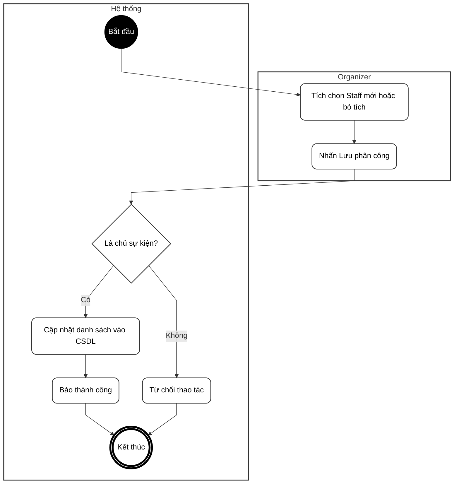

# BIỂU ĐỒ HOẠT ĐỘNG - PHẦN C: PHÂN CÔNG NHÂN SỰ (UC15)

---

## UC15 – Phân công Nhân viên (Staff) cho sự kiện

```mermaid
%%{init: {"flowchart": {"curve": "linear"}}}%%
flowchart TD
    classDef default fill:#fff,stroke:#333,stroke-width:1.5px,color:#000,rx:10px,ry:10px;
    classDef startNode fill:#000,stroke:#000,color:#fff;
    classDef endNode fill:#fff,stroke:#000,stroke-width:4px,color:#000;
    classDef hidden fill:none,stroke:none,color:none;

    subgraph Organizer [Organizer]
        direction TB
        T_start(" "):::hidden
        A(Tích chọn Staff mới hoặc bỏ tích)
        B(Nhấn Lưu phân công)
        T_end(" "):::hidden
    end

    subgraph System [Hệ thống]
        direction TB
        H_start(" "):::hidden
        Start((Bắt đầu)):::startNode
        C{Là chủ sự kiện?}
        D(Từ chối thao tác)
        E(Cập nhật danh sách vào CSDL)
        F(Báo thành công)
        End(((Kết thúc))):::endNode
        H_end(" "):::hidden
    end

    T_start ~~~ H_start
    T_end ~~~ H_end
    Start --> A
    A --> B
    B --> C
    C -- Không --> D
    C -- Có --> E
    E --> F
    F --> End
    D --> End

    style Organizer fill:#fff,stroke:#333,stroke-width:2px
    style System fill:#fff,stroke:#333,stroke-width:2px
```
