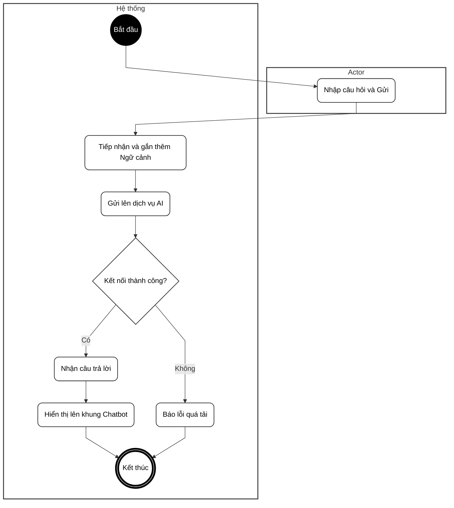

# BIỂU ĐỒ HOẠT ĐỘNG - PHẦN E: TÍNH NĂNG NÂNG CAO (UC23)

---

## UC23 – Tương tác với Trợ lý ảo AI

```mermaid
%%{init: {"flowchart": {"curve": "linear"}}}%%
flowchart TD
    classDef default fill:#fff,stroke:#333,stroke-width:1.5px,color:#000,rx:10px,ry:10px;
    classDef startNode fill:#000,stroke:#000,color:#fff;
    classDef endNode fill:#fff,stroke:#000,stroke-width:4px,color:#000;
    classDef hidden fill:none,stroke:none,color:none;

    subgraph Actor [Actor]
        direction TB
        T_start(" "):::hidden
        A(Nhập câu hỏi và Gửi)
        T_end(" "):::hidden
    end

    subgraph System [Hệ thống]
        direction TB
        H_start(" "):::hidden
        Start((Bắt đầu)):::startNode
        B(Tiếp nhận và gắn thêm Ngữ cảnh)
        C(Gửi lên dịch vụ AI)
        D{Kết nối thành công?}
        E(Báo lỗi quá tải)
        F(Nhận câu trả lời)
        G(Hiển thị lên khung Chatbot)
        End(((Kết thúc))):::endNode
        H_end(" "):::hidden
    end

    T_start ~~~ H_start
    T_end ~~~ H_end
    Start --> A
    A --> B
    B --> C
    C --> D
    D -- Không --> E
    D -- Có --> F
    F --> G
    G --> End
    E --> End

    style Actor fill:#fff,stroke:#333,stroke-width:2px
    style System fill:#fff,stroke:#333,stroke-width:2px
```
